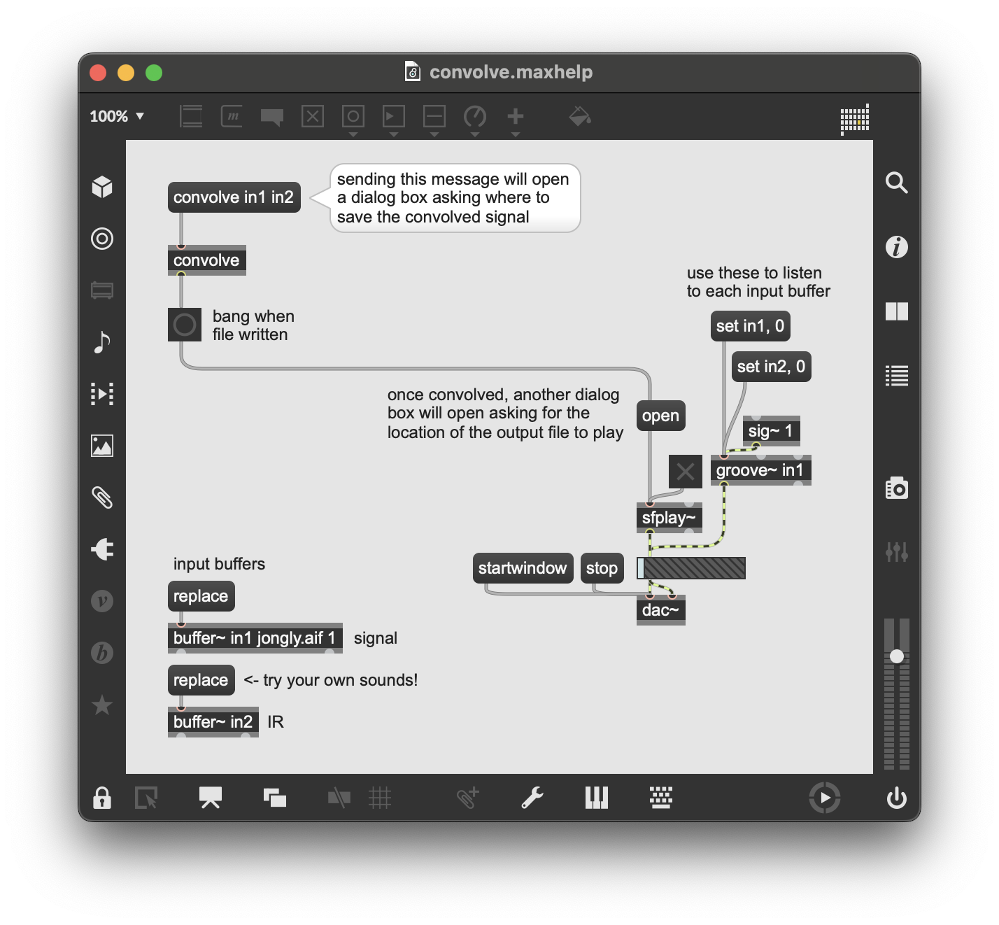

#  convolve

`convolve` is a Max external that convolves two signals and saves the output to a specified file. This was written primarily as an attempt to understand the development process behind convolving two signals, which subsequently leads into the following topics:
- writing externals for Max/MSP using [the SDK](https://cycling74.com/downloads/sdk);
- the forward and inverse FFT (using vDSP from Apple's [Accelerate framework](https://developer.apple.com/documentation/accelerate));
- time-domain convolution (equivalent to frequency-domain vector multiplication);
- the construction of .wav files; and
- C, of course!

Starting only with a fundamental understanding of C, the majority of what takes place in this code is entirely new to me. Thus, the external is bound to produce bugs! **For the purpose of the assignment, the ideal test case is achieved by convolving two mono signals stored with equivalent sampling rates.** If using for convolution reverb, the impulse response (IR) should be shorter than the signal being affected.

The structure of the object (e.g., how inlets receive data, how data is formatted, etc.) was in part inspired by the `bufconvolve~` object from the [HISSTools Impulse Response Toolbox (HIRT)](https://github.com/HISSTools/HISSTools_Impulse_Response_Toolbox) by [Alex Harker](a.harker@hud.ac.uk) and [Pierre Alexandre Tremblay](p.a.tremblay@hud.ac.uk) with Pete Dowling. Having a similar reference to work with when attempting to stick to convention was incredibly useful, and if on the hunt for something that resembles this object but far more optimized, check out their package from the Max Package Manager! [[1]](#1)

## Installation
**THIS CODE HAS ONLY BEEN TESTED ON MACOS 13.3.1!!!** The included files only support Max for MacOS, and I'm uncertain how it runs on older versions. Thus, ideally, this code is to be tested on the latest MacOS version. For any other systems, use at your own risk. This software does not come with any warranty!!!

To install, either `cd` into `~/Documents/Max\ 8/Packages/` and `git clone` this repository, or download the latest release and unzip the folder into the same path. As long as this directory is accessible to Max, the `convolve` object should available for use within any patcher!

## Usage
`convolve` takes a message following the format `[convolve input1 input2]`, where `input1` and `input2` are the names of two `buffer~` objects containing the signals to be convolved. The object then computes the spectrums, multiplies the spectrums, and transforms the resulting spectrum back to the time domain. The time domain result is written to the .wav file specified by the user when prompted after the message is sent. When the output file is complete, a bang is sent out of the outlet.

For a pre-configured example, see the included Max help file!

## Explanation
**vDSP.** The documentation for the Accelerate framework is a nightmare to navigate without much context. Here are some things I wish I knew earlier:
- **Data Packing:** Accelerate comes with two important data types regarding the FFT. These are `DSPComplex` and `DSPSplitComplex`. Both of these types are used to represent complex numbers, with `DSPComplex` representing one complex value with a single `.real` and `.imag` component. `DSPSplitComplex` is an array of complex values, with all real parts stored in the `.realp` component and all imaginary parts stored in the `.imagp` component.
\
\
To conserve memory, vDSP requires that incoming sample data into FFT functions (e.g., [`vDSP_fft_zrip()`](https://developer.apple.com/documentation/accelerate/1450150-vdsp_fft_zrip)) be packed such that every even sample is stored in the array of real values, and every odd sample is stored in the imaginary array. That is, for a set of samples `[0 1 2 3]`, the corresponding packed signal (which gets passed to the FFT) would be `DSPSplitComplex(realp: [0 2], imagp: [1 3])`.
\
\
Input data can be packed using the [`vDSP_ctoz()`](https://developer.apple.com/documentation/accelerate/1450388-vdsp_ctoz) function and casting an array of floats to be treated as an array of complex values:
    - `vDSP_ctoz((DSPComplex*)samples, 2, &samplesSplit, 1, num_samples/2)`
        - The first stride is 2 since two consecutive samples correspond to 1 (second stride) complex value. For the same reason, the number of elements to process is half the number of samples.

- **FFT lengths:** Both `vDSP_create_fftsetup()` and `vDSP_fft_zrip()` require specific FFT lengths for computation. It was unclear to me how these values were supposed to be computed, so hopefully this sheds some light for anyone in the same boat:
    - When pre-allocating memory for the FFT using `vDSP_create_fftsetup()`, the first argument should be the $\log_2x$, where $x$ is the total FFT length defined for two signals A and B being convolved as length(A) + length(B) - 1.
    - When computing the FFT with `vDSP_fft_zrip()`, the fourth argument is $\log_2y$, where $y$ is the number of elements in the signal to be transformed.

In the interest of time, I'll leave this here for now. I'll continue adding to this though! Feel free to direct any question to isaiahdoyle56@gmail.com in the meantime!

### Discussion
###### ***what i learned:***
First and foremost, the Max SDK was totally new to me, and it took significant time to get used to the API (e.g., how externals are structured in C, how to test custom externals in Max, then more specific concepts like reading from buffers). Everything I learned on this front is thanks to the [API documentation](https://cycling74.com/sdk/max-sdk-8.2.0) [[2]](#2).

Once I had a basic understanding of the SDK through reading [the documentation](#2), I took to attempting to decipher the vDSP portion of Apple's [Accelerate framework](https://developer.apple.com/documentation/accelerate). This led to a *long* journey of researching vDSP data packing, how the framework can be used, and how the FFT works. I'm in a completely different place now than I was before beginning this project, largely due to the amount of time I spend studying just the FFT. Some resources that helped support my understanding of the frameork can be found in the bibliography section [[3]](#3) [[4]](#4).

Once main functionality of the object was complete, it was time to begin writing to a .wav file. I had also had no direct experience with how .wav files are formatted, so this took another significant amount of time to learn properly. Again, a few resources that supported this concept can be found in the bibliography [[5]](#5) [[6]](#6).

###### ***what was difficult:***
The most time consuming part of this project, maybe unsurprisingly, was trying to wrap my head around the vDSP documentation for the FFT computations. There's an immense amount of specificity regarding how data is packed and interpreted (i.e., using `DSPSplitComplex`), and with only a minimum understanding of the Fourier transform it was tedious to try to learn what values (e.g., signal length vs. fft length) the API needed when. If not for the references listed above ([[3]](#3) [[4]](#4)), I definitely wouldn't have completed the project in the time I did.

## Bibliography
<a id="1">[1]</a>
Harker, Alexander and Tremblay, Pierre Alexandre (2012).
[*The HISSTools Impulse Response Toolbox: Convolution for the Masses.*](https://eprints.hud.ac.uk/id/eprint/14897/)
ICMC 2012: Non-cochlear Sound. The International Computer Music Association, pp. 148-155.

<a id="2">[2]</a>
Max API (8.2.0).
https://cycling74.com/sdk/max-sdk-8.2.0.

<a id="3">[3]</a>
StackOverflow users [P i](https://stackoverflow.com/users/435129/p-i), [Art Gillespie](https://stackoverflow.com/users/126606/art-gillespie) (2010).
[*Using the Apple FFT and Accelerate Framework*](https://stackoverflow.com/questions/3398753/using-the-apple-fft-and-accelerate-framework).
Question posted by user [Ian Oswald](https://stackoverflow.com/users/406076/ian-oswald).

<a id="4">[4]</a>
KVR Marketplace user hugoderwolf (2011).
[*Fast Convolution with vDSP/Accelerate Framework*](https://www.kvraudio.com/forum/viewtopic.php?t=275755).

<a id="5">[5]</a>
Urban, Eric (2022).
[*The joys of writing a WAV file*](http://www.hydrogen18.com/blog/joys-of-writing-a-wav-file.html).

<a id="6">[6]</a>
Karplus, Kevin (2011).
[*Making WAV files from C programs*](https://gasstationwithoutpumps.wordpress.com/2011/10/08/making-wav-files-from-c-programs/).
